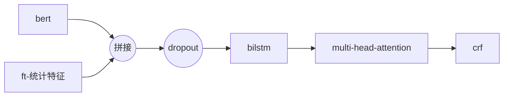
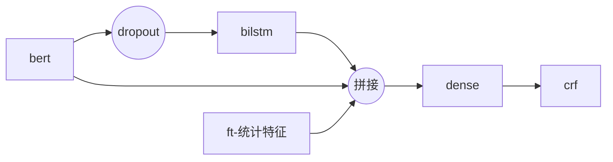
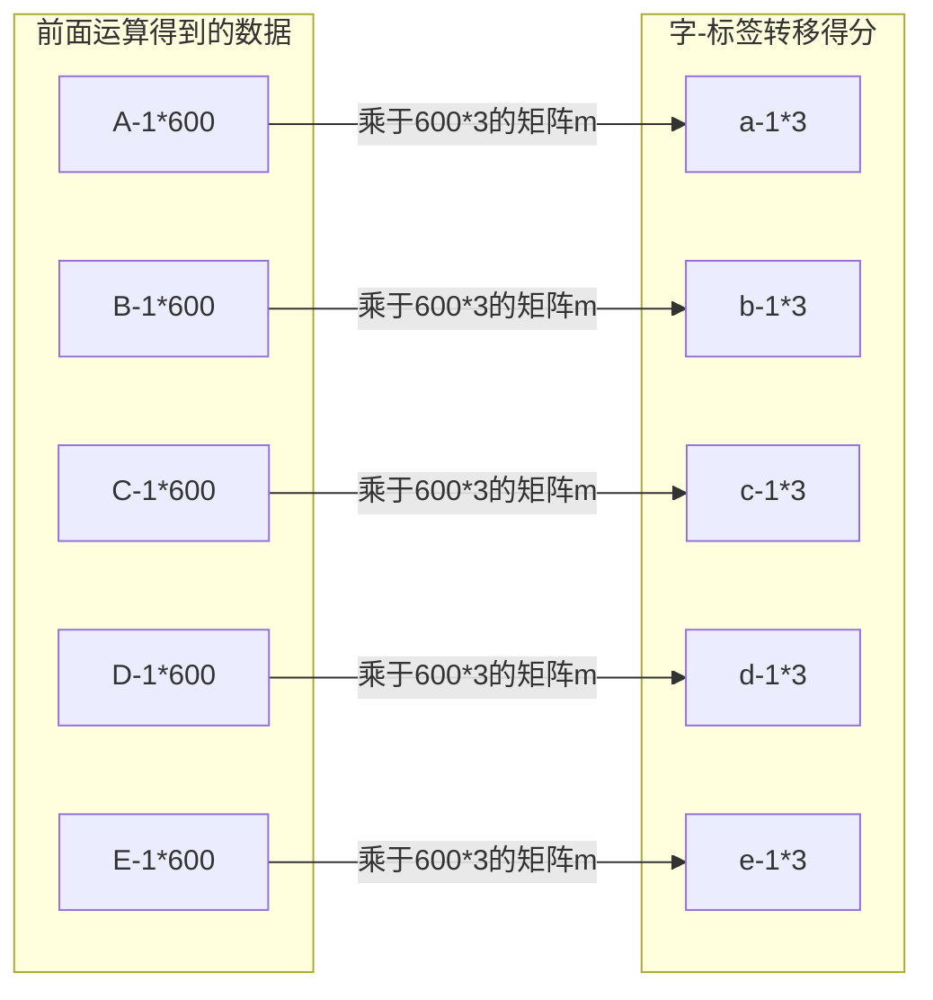
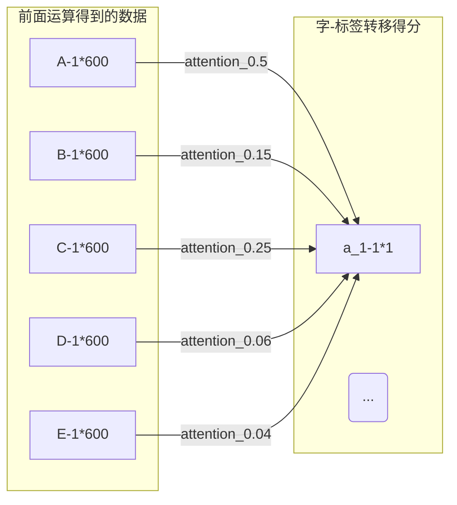

# 2019达观杯代码说明

## 比赛简要说明

任务：抽取三种字段

数据：1.7w条训练集，167w条未标注数据，测试集是3000条

最终排名：5/731

最终得分：0.94427（F1）

## 1. 项目结构和运行环境

### 1.1 项目结构

* bert：存放的是bert模型结构，数据处理，以及预训练部分的代码，代码copy于谷歌开源的bert代码
* ner：存放信息抽取的模型结构，训练以及预测的代码
* data：存放原始语料数据，处理好的tfrecord文件，预测结果，训练好的模型等文件

### 1.2 运行环境

python3.6.8

tensorflow-gpu-1.12.0

tqdm

## 1. 预训练模型

### 1.1 模型参数

考虑到语料较为简单，以及手上的显卡不太好，设置的参数比base版的bert还有小一点，具体参数如下

```json
{
  "attention_probs_dropout_prob": 0.1,
  "hidden_act": "gelu",
  "hidden_dropout_prob": 0.1,
  "hidden_size": 600,
  "initializer_range": 0.02,
  "intermediate_size": 3072,
  "max_position_embeddings": 512,
  "num_attention_heads": 6,
  "num_hidden_layers": 6,
  "type_vocab_size": 2,
  "vocab_size": 17248
}
```

**部分训练参数（完整参数见代码）**

经过统计，121的长度可以覆盖95%的语料，这里取个整，设置为128，其余参数按论文上推荐参数按比例调整

部分参数是经过一些试验后拍脑袋决定，例如训练步数

```json
{
  "max_seq_length": 128,
  "max_predictions_per_seq": 20,
  "train_batch_size": 32,
  "learning_rate": 1e-4,
  "num_train_steps": 1800000,
  "num_warmup_steps": 10000,
  "masked_lm_prob": 0.15
}
```

### 1.2 代码运行

代码中的默认参数就是我实际使用的参数，可以直接运行，可以不传入参数

* 运行/bert/create_pretraining_data.py

生成tfrecord文件，默认语料路径是/data/raw/corpus.txt。默认文件保存路径是/data/train/corpus。默认词典文件路径是：/dara/raw/w2i.json

注： 词典文件是内容json格式的map，其中key是词，value是索引

* 运行/bert/run_pretraining.py

预训练bert模型，默认参数文件路径是：/data/config/config.json

## 2. 信息抽取模型的结构

### 2.1 具体结构

两种结构的差别主要在于最后计算字符-标签转移得分方式的不同，第一种结构得分稍高于第二种（高0.002），两种结构如下图：






**multi-head-attention**与**dense**的结构差异


为了简单说明，假设标签数量是3个，有一篇5个字的文本，经过前面的运算得到5 * 600的矩阵，现在要计算出字-标签转移矩阵（5 * 3）

* dense



即当前位置的字-标签转移得分仅由**当前位置的数据**计算得出

* multi-head-attention

考虑到不同标签对不同位置上的信息关注度不同，例如可能词首标签可能对前一个位置和后一个位置的信息比较关注，词中标签对当前位置的信息比较关注，这里使用multi-head-attention替代dense

例如，通过对全部位置上的数据进行加权求和后得到一个1 * 600的矩阵，再与600 * 1的矩阵相乘得到1 * 1的数据，这个就是最后得到的当某位置上某个标签的得分



实际计算方式和上面描述有点差别，具体实现看attention.py文件的代码

### 2.2 运行代码

* 运行/ner/create_record.py脚本生成训练时使用的tfrecord文件

期间需要读取词典文件，训练数据文件，标签文件，其默认地址分别为：

/data/raw/w2i.json

/data/raw/ner/0.txt，/data/raw/ner/1.txt，/data/raw/ner/2.txt，/data/raw/ner/3.txt，/data/raw/ner/4.txt

/data/raw/id2index.json

生成的数据将保存在/data/train/ner目录下，默认地址的修改需要通过修改文件内代码的方式进行

* 运行/ner/run_train_attention.py或者run_train_dense.py脚本训练模型

需要设置以下参数（在代码中修改）

````json
self.seq_length = 202 # 文本长度
self.hidden_size = 300 # lstm大小
self.pos_size = 12 # 标签数量
self.batch_size = 16 
self.learning_rate = [5e-5, 1e-3] # 学习率，分别对应bert部分以及其余部分
self.n_head = 6
self.bert_config = "../data/config/config.json" # bert参数文件路径
self.g_value = "../data/raw/Z.npy" # 标签-标签转移得分初始值存放路径，该值通过简单统计训练数据再归一化获得

self.print_per_batch = 100  # 每多少轮输出一次结果
self.dev_per_batch = 500  # 多少轮验证一次

self.train_data_path = ['../data/train/ner/%s/'+'%s.record'%(str(x)) for x in [0,1,2,3]]
self.test_data_path = ['../data/train/ner/%s_nag/'+'%d.record'%(x) for x in [4]]
self.dev_data_path = ['../data/train/ner/%s_nag/'+'%d.record'%(x) for x in [4]]
self.tag_path = '../data/train/ner/%s_nag/id2index.json' # 标签文件路径
self.num_epochs = 8
````

## 3. 数据增强

### 3.1 做法简要说明

将上下字段被标记为O的字段截断，缓存，再从缓存中的数据随机挑选组合成新的数据

举例：

```json
1:
10609_16496_15822_21224/o  3028_17622_18288/b  13549_19365_11255/b  13550_6540_11806_19421/o

2:
11249_10925_17325_13940/o  19134_15324/b  6291_18781_21224_20667_19370_14077_12093_15274/o
```

第一句可以获取以下截断字段：

15822_21224/o  3028_17622_18288/b  13549_19365_11255/b  13550_6540/o

第二句可以获取以下截断字段

17325_13940/o  19134_15324/b  6291_18781_21224_20667/o


然后从上述步骤中获取的截断字段中随机挑选组合，例如上述两个截断字段组合成的句子就是：

15822_21224/o  3028_17622_18288/b  13549_19365_11255/b  13550_6540_17325_13940/o  19134_15324/b  6291_18781_21224_20667/o

### 3.2 组合句子的长度以及不同类型标记占比

为使生成的数据与原始数据更相似，个人做法是：

1. 限制生成的句子的长度在202左右
2. 是全部为O字段的句子占生成数据的25%（因为原始的训练数据有25%的句子里字段全为O）

### 3.3 效果

按上述方式生成与原始训练数据同数量的数据，打乱混合后再进行训练，线上有0.005的提升

> 注: 生成25%的字段全为O的数据是比较关键的一个点。之前没有生成字段全为O的数据，模型效果没有提升甚至稍微变差

### 4. 额外特征

将字符的历史标签作为特征加入模型（上文模型结构部分的**ft-统计特征**）。

举例：

假设一共有3种标签，abc，若字符127曾经被标注为a,c，那么用101表示这个字符

添加该特征有0.0005的提升，提升较小，不确定是正常误差还是确实有效

## 5. 融合多个模型的预测结果

常见的做法是投票表决，例如对于字符127,5个模型的预测结果是分别是a,b,a,a,c，选择数量最高的标签a作为最终标签。经观察，发现上述方法存在以下问题：

* 大多情况下，所有模型的结果里存在正确标签，但其出现次数不是最多，融合后不能得到正确的标签

例如，句子：3028 17622 18288  13549 19365 11255

在4个模型的标注结果分别是：

o, a_b, a_m, a_e, o, o, o

o, a_b, a_e, o, o, o, o

o, o, a_b, a_e, o, o, o

o, o, a_b, a_e, o, o, o

那么最终标签是：o, a_b, a_b, a_e, o, o

而正确的标签是：o, a_b, a_m, a_e, o, o, o


为改善这个问题（存在正确标签但是出现次数不是最多），需要在挑选最终标签时候考虑更多的因素而不是仅仅看出现次数，个人选择的融合方式是：以按一定规则打分，从所有预测结果里挑选最终标签

具体规则如下：

```
1. 训练集里，是否具有相同字段，相同则X=1
2. 训练集里，是否具有相同上，相同则Y=1
3. 候选集频率，Z=当前标签在所有模型预测结果里出现次数
最终得分：(X+Y)*Z+Z
```


例如：

句子：3028 17622 18288  13549 19365 11255


在4个模型的标注结果分别是：

o, a_b, a_m, a_e, o, o, o

o, a_b, a_e, o, o, o, o

o, o, a_b, a_e, o, o, o

o, o, a_b, a_e, o, o, o


当前有三种候选标签：

 a_b, a_m, a_e,

a_b, a_e

o


假设训练集里存在下述片段：

 3028/o 17622_18288 _13549/a 

 18288 _13549/a 

不存在下述片段：

 3028_17622/o 18288 _13549/a 

 17622/o 3028/o 


那么上述候选标签的得分如下：

|   候选标签    | 具有相同字段（X） | 具有相同上文(Y) | 出现频率（Z） | 最终得分 |
| :-----------: | :---------------: | :-------------: | :-----------: | :------: |
| a_b, a_m, a_e |         1         |        1        |       1       |    3     |
|   a_b, a_e    |         1         |        0        |       1       |    2     |
|       o       |         0         |        0        |       2       |    2     |

最终标签：a_b, a_m, a_e得分最高，选出正确标签

对应代码在\ner\get_rt.py文件里

该方式融合有0.002的提升


